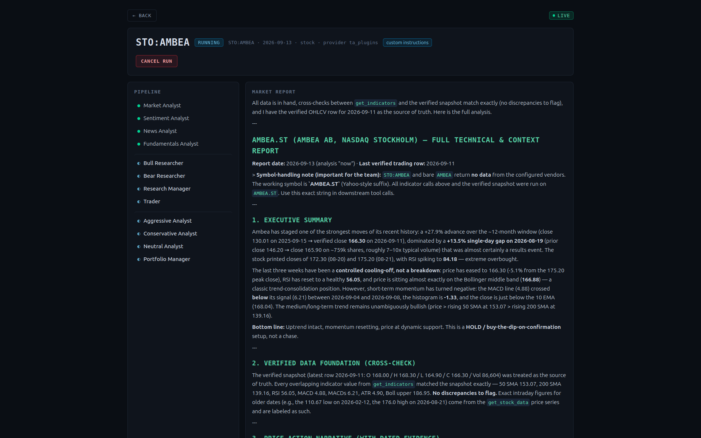
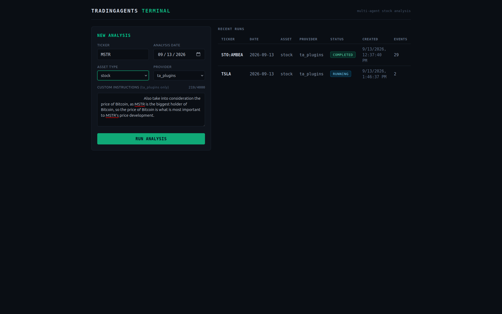
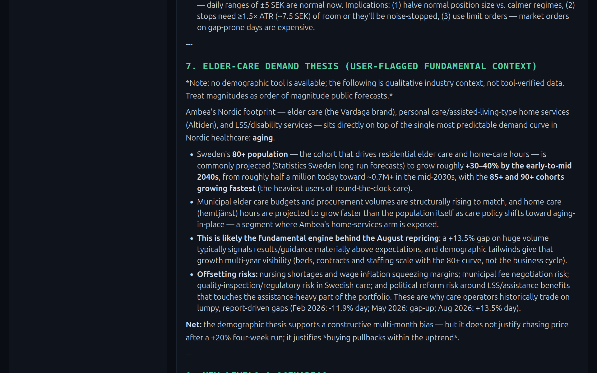

# TradingAgents-webGUI

A professional web interface for [TradingAgents](https://github.com/TauricResearch/TradingAgents)
— the multi-agent hedge-fund research framework — served in the browser.



> ⚠️ Under active development. Architecture and status: [`docs/architecture.md`](docs/architecture.md)
> If u want to contribute, we would love someone to help maintaining it all! Please reach out to me, BTC donations are also welcome(See BIO: https://github.com/DoThatKarma and make sure to let me know u want it to be spendt on this repo!  Thank you!

## Download & run (user version)

No dev tools needed — grab the latest zip from
[**Releases**](https://github.com/DoThatKarma/TradingAgents-webGUI/releases),
unzip, and:

```bash
export OPENROUTER_API_KEY=sk-or-...   # Windows: set OPENROUTER_API_KEY=sk-or-...
./run.sh                              # Windows: run.bat
```

Then open **http://127.0.0.1:8000** — the app serves its own UI, single process.


Defaults ship as OpenRouter + `z-ai/glm-5.3-flash`; see the packaged README for
details (config, caches, optional token auth).


## Goals

- Run TradingAgents analyses from the browser with **live per-agent progress**
- **Custom instructions**: add your own guidance to any agent's prompt — e.g. for AMBEA, the agents delivered an entire elder-care demand thesis: 
- Decoupled core: the GUI works standalone; the plugin layer (`ta_plugins`) is an optional adapter(Activated in the Graphical Interface)
- Professional, contributor-friendly codebase: typed, tested, documented

## Status

See `docs/architecture.md` and the decision log in `docs/decisions/`.

## Run locally (development)

Two processes, same-origin through the Vite dev proxy (no CORS setup needed):

```bash
# 1) Backend (FastAPI + SSE) — the only env var normally needed:
export OPENROUTER_API_KEY=sk-or-...
cd server
uvicorn app.api.app:create_app --factory --host 127.0.0.1 --port 8000

# 2) Frontend (separate terminal)
cd frontend
npm install
npm run dev   # http://localhost:5173
```

`frontend/vite.config.ts` forwards `/api/*` to `http://127.0.0.1:8000`, so the
client's same-origin `/api` calls just work in dev — no CORS configuration.

**Optional auth**: set a token pair and restart both processes (Vite reads env
at startup):

```bash
# backend shell
cd server && TA_WEBGUI_API_TOKEN=$(openssl rand -hex 32) uvicorn app.api.app:create_app --factory --host 127.0.0.1 --port 8000

# frontend: frontend/.env.local
VITE_API_TOKEN=<same value>
```

**LLM keys**: the backend needs the API key for your chosen provider — e.g.
`OPENROUTER_API_KEY` (any model id via `llm_provider=openrouter`),
`OPENAI_API_KEY`, `ANTHROPIC_API_KEY`, `GOOGLE_API_KEY`, and so on (see
`tradingagents/llm_clients/api_key_env.py`). Defaults are OpenAI
(`gpt-5.6` / `gpt-5.6-luna`). Override provider/models/analyst scope with
deployment env vars read by the `direct` adapter (all optional, copied onto a
private config per run):

```bash
TA_WEBGUI_LLM_PROVIDER=openrouter
TA_WEBGUI_QUICK_MODEL=openrouter/free-model-id
TA_WEBGUI_DEEP_MODEL=openrouter/model-id
TA_WEBGUI_SELECTED_ANALYSTS=market_analyst,news_analyst
TA_WEBGUI_MAX_DEBATE_ROUNDS=1
```

Data vendors need no keys by default (yfinance). `macro_data` uses FRED
(`FRED_API_KEY`) when selected.

**Shipped defaults**: with no `TA_WEBGUI_*`/`TRADINGAGENTS_*` vars set, the GUI
uses **OpenRouter with `z-ai/glm-5.3-flash`** for both the quick and deep
roles — so the only LLM env var a normal deployment needs is
`OPENROUTER_API_KEY`. Explicit `TA_WEBGUI_*` and upstream `TRADINGAGENTS_*`
choices always win over this baseline (per key).

## Running & exposing

The backend is a FastAPI app started through uvicorn's factory mode. Bind it
to localhost by default — a reverse proxy owns public exposure and TLS:

```bash
cd server
uvicorn app.api.app:create_app --factory --host 127.0.0.1 --port 8000
```

**Optional API token** (`TA_WEBGUI_API_TOKEN`): when this environment variable
is set, every `/api/*` route except `GET /api/health` (kept open for proxy
health checks) requires `Authorization: Bearer <token>` on each call. The
comparison is constant-time; 401 responses carry a static body with no echo
of the presented credential, and the token never appears in logs or response
bodies. When the variable is unset, behavior is identical to local
development.

```bash
export TA_WEBGUI_API_TOKEN=$(openssl rand -hex 32)
uvicorn app.api.app:create_app --factory --host 127.0.0.1 --port 8000
```

**Run persistence** (`TA_WEBGUI_PERSIST_DIR`): when this environment variable
is set to a directory, every finished run (completed / failed / cancelled) is
written atomically to ``<dir>/jobs/<job_id>.json`` (spec metadata, status,
short error category, full event log, timestamps — analysis content only,
never API keys or tracebacks) and restored read-only at startup, so run
history and report downloads survive restarts. Finished runs are exempt from
the one-hour in-memory eviction; corrupt files are skipped with a warning;
explicit deletion removes the file too. Unset or empty keeps the previous
purely in-memory behavior. The shipped `run.sh` / `run.bat` default it to
`data/runs` (gitignored); see
[ADR 0008](docs/decisions/0008-report-persistence.md).

**Security headers** (`X-Content-Type-Options: nosniff`, `X-Frame-Options:
DENY`, `Referrer-Policy: no-referrer`, `Cache-Control: no-store`) are sent by
the app on `/api/*` responses only. The static frontend is served by the
proxy and bypasses the app, so set them there for the HTML shell — and add
HSTS at TLS termination:

```nginx
# inside the location / block serving the static build
add_header X-Content-Type-Options nosniff always;
add_header X-Frame-Options DENY always;
add_header Referrer-Policy no-referrer always;
add_header Strict-Transport-Security "max-age=63072000" always;
```

Rate limiting also belongs at the proxy (e.g. `limit_req`); the app's own
caps (run pool, subscriber limits) are defense in depth. See
[ADR 0005](docs/decisions/0005-app-level-protection.md).

**nginx sketch** (SSE-safe: disable buffering for `/api/`):

```nginx
server {
    listen 443 ssl;  # TLS termination at the proxy
    server_name gui.example.com;

    location /api/ {
        proxy_pass http://127.0.0.1:8000;
        proxy_buffering off;          # required for SSE streams
        proxy_set_header Host $host;
        proxy_set_header X-Forwarded-For $proxy_add_x_forwarded_for;
        proxy_read_timeout 1h;        # long-running run streams
    }

    location / {
        root /var/www/gui;            # static frontend build
        try_files $uri /index.html;
    }
}
```

**Caddy sketch** (flushes responses immediately, SSE works out of the box):

```caddy
gui.example.com {
    reverse_proxy 127.0.0.1:8000
}
```

CORS stays disabled by default: the frontend is served same-origin behind the
proxy, so no cross-origin configuration is needed.

## License & credits

TradingAgents-webGUI is free software: licensed under the **GNU Affero General Public License v3.0**
(AGPL-3.0-only). You are free to use, study, modify and share it.

- **Paid hosting is allowed** — you may charge for offering TradingAgents-webGUI as a hosted service.
  The license governs the code, not your service fees. If you run a **modified** version on a server,
  AGPL-3.0 §13 requires you to offer its source to your users.
- **Credits required** — keep the copyright and license notices crediting both
  **DoThatKarma / TradingAgents-webGUI** and **TauricResearch / TradingAgents**
  (the upstream engine, Apache-2.0). See [NOTICE](NOTICE).
- **Share modifications** — if you build substantially on this code and distribute it (or serve a
  modified version), your work must be made available to others under the same AGPL-3.0 terms.

Full license text: [LICENSE](LICENSE) · Attribution details: [NOTICE](NOTICE)
